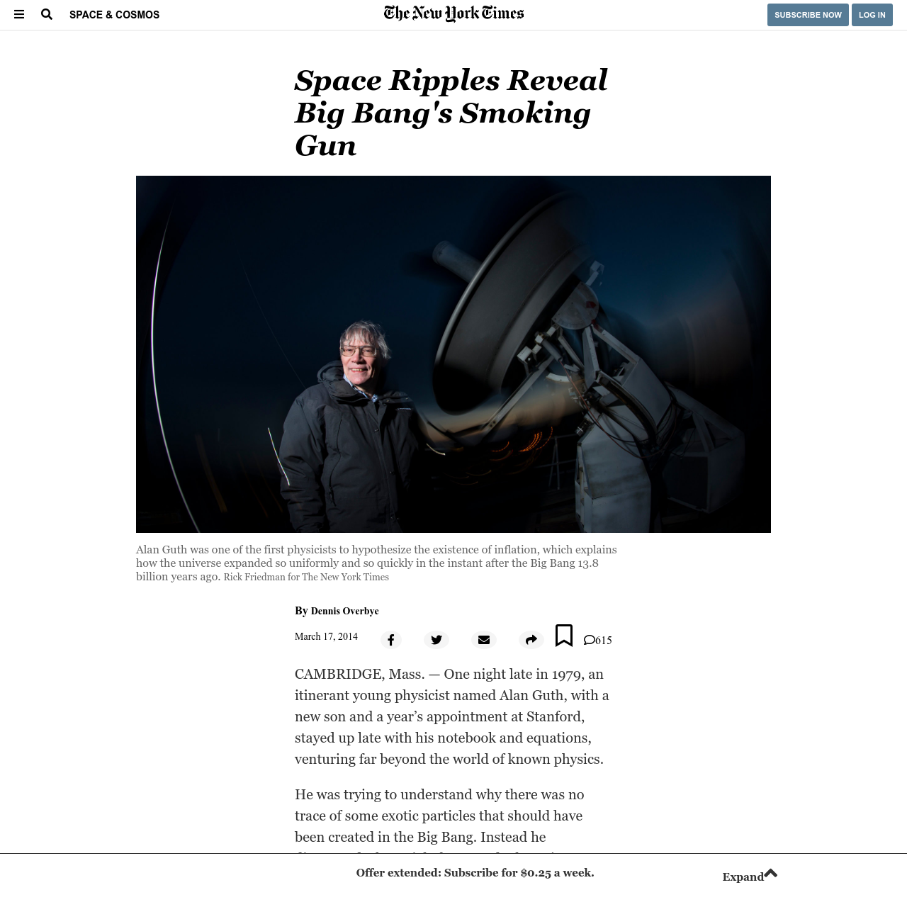

# new-york-times-clone

This project aims to recreate [this article from the New York Times](https://www.nytimes.com/2014/03/18/science/space/detection-of-waves-in-space-buttresses-landmark-theory-of-big-bang.html?_r=0)

Demo available at: [https://nickmwangemi.github.io/new-york-times-clone/](https://nickmwangemi.github.io/new-york-times-clone/)

